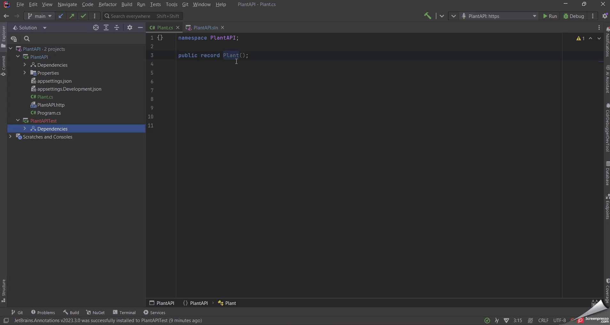
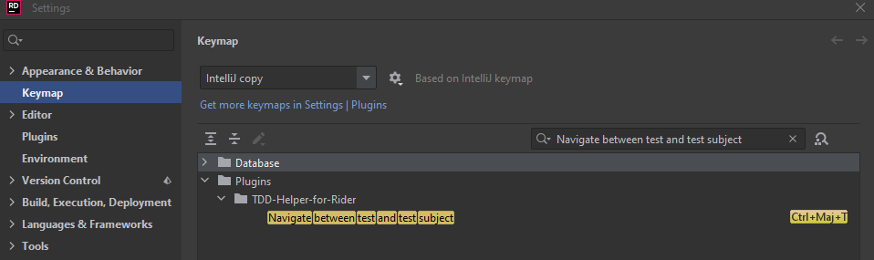

# TDD-Helper-for-Rider

## Description

<!-- Plugin description -->
The purpose of this plugin is to give you the best TDD experience in Rider IDE.

This plugin is currently under development you can expect to see new features coming soon. 
Stay tuned for updates and thank you for your patience and support!

## Features

* Navigate easily from your test and your implementation
* Create a test in the appropriate location from your test subject

Using a single shortcut: `ctrl + shift + T` by default.
<!-- Plugin description end -->

**This shortcut can already be assigned in Rider please make sure that the only action bind 
to it is `Navigate between test and test subject` or change the default shortcut (see below).**

## Customize

### Change the default shortcut

Go to `Keymap`, search `Navigate between test and test subject` and
then change the keymap.

---
Plugin based on the [IntelliJ Platform Plugin Template][template].

[template]: https://github.com/JetBrains/intellij-platform-plugin-template
[docs:plugin-description]: https://plugins.jetbrains.com/docs/intellij/plugin-user-experience.html#plugin-description-and-presentation
