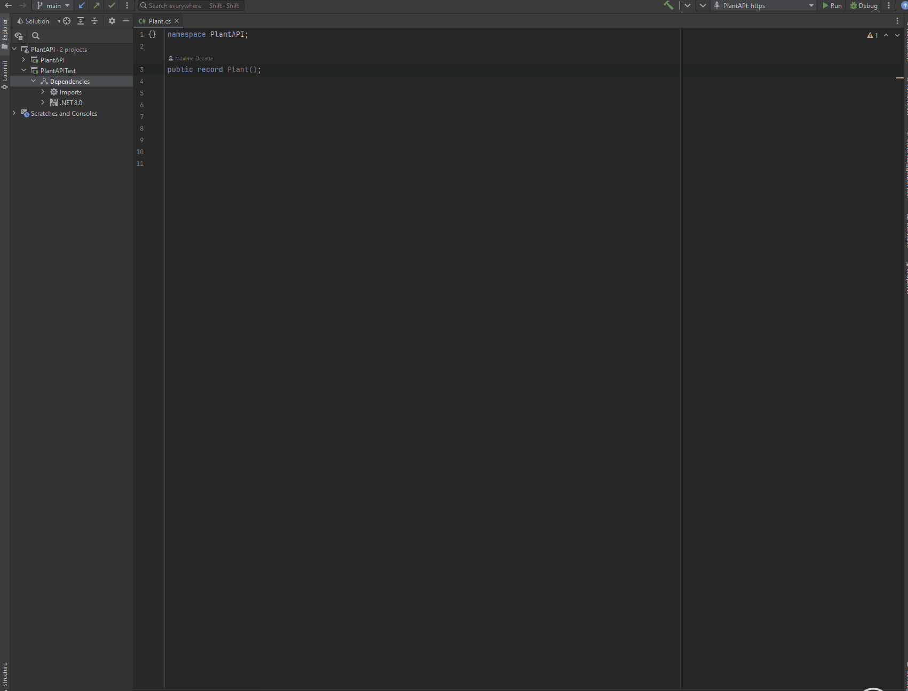

# TDD-Helper-for-Rider

## Description

<!-- Plugin description -->
The purpose of this plugin is to give you the best TDD experience in Rider IDE.

## Features

* Navigate easily from your test and your implementation using the shortcut
* Create a test in the appropriate location from your test subject

Using a single shortcut: `ctrl + shift + T` by default.
<!-- Plugin description end -->

**This shortcut can already be assigned in Rider please make sure that the only action bind 
to it is `Navigate between test and test subject` or change the default shortcut (see below).**

## Customize

### Change the default shortcut

Go to `Keymap`, search `Navigate between test and test subject` and
then change the keymap.

---
Plugin based on the [IntelliJ Platform Plugin Template][template].

[template]: https://github.com/JetBrains/intellij-platform-plugin-template
[docs:plugin-description]: https://plugins.jetbrains.com/docs/intellij/plugin-user-experience.html#plugin-description-and-presentation
